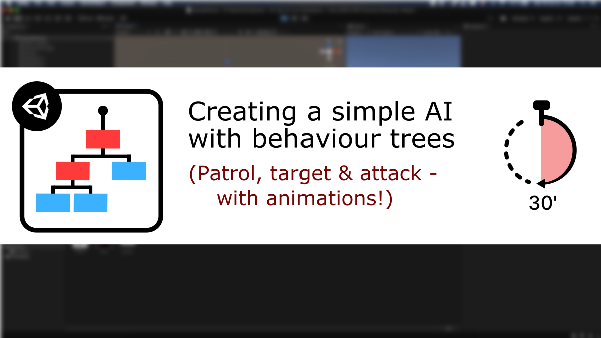

# [Unity/C#] A simple behaviour tree

**Mina Pêcheux - November 2021**

How can we create a simple guard AI using the behaviour tree pattern? Let's discover more in this video/text tutorial: "How to create a simple behaviour tree in less than 30 minutes" :)

You can read it in text format [on Medium](https://mina-pecheux.medium.com/how-to-create-a-simple-behaviour-tree-in-unity-c-3964c84c060e), or watch it [on Youtube](https://www.youtube.com/watch?v=aR6wt5BlE-E).

In this less than 30 minutes-tutorial, I'm discussing what behaviour trees are, why they are often better at modelling complex systems than [finite state machines](https://github.com/MinaPecheux/UnityTutorials-FiniteStateMachines) and how we can apply this classic pattern to the design of a simple guard AI to have it patrol, target enemies and attack!

This Github repo contains the scripts that are coded in the tutorial, as well as all the resources (imported models, materials, particle systems...) that are used throughout this episode :)

